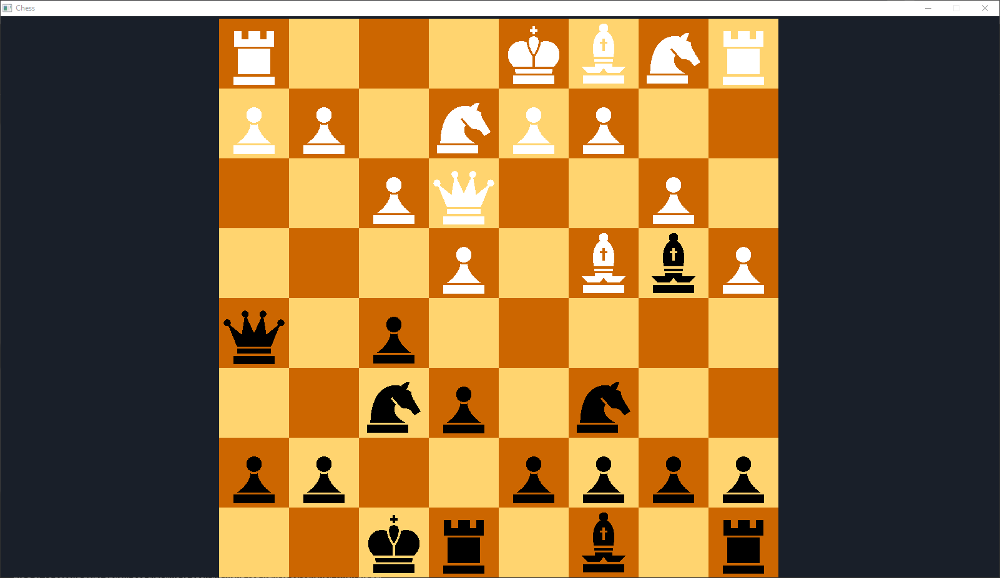

# Chess

Game features:
 Determines valid moves such that the king is not left in check or will be put into check.
 Highlights valid moves on the board for convenience.

Board features:
 Castling
 En passant
